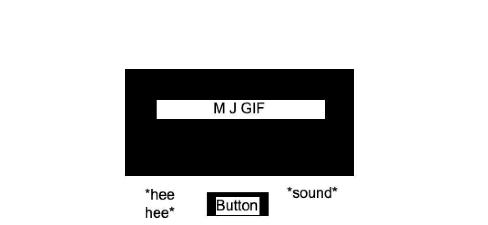

# big-project1

yeet

## App Title:

The King's API

## App Description:

Will provide Michael Jackson GIF files, will have a button that allows you to refresh for new MJ GIF

## API:

GIPHY GIF API

## API Snippet:

A sample snippet of JSON from a successful GET request you have made to your API using Postman.

```js
let url =
  "https://api.giphy.com/v1/gifs/search?api_key=P7JZb1su5AOUPUjlc1zWpqSFegSuG5rE&q=Michael+Jackson&limit=5&offset=0&rating=r&lang=en";
fetch(url)
  .then((res) => res.json())
  .then((data) => console.log(data));
```

```js{
    "data": [
        {
            "type": "gif",
            "id": "guufsF0Az3Lpu",
            "url": "https://giphy.com/gifs/vevo-halloween-michael-jackson-thriller-guufsF0Az3Lpu",
            "slug": "vevo-halloween-michael-jackson-thriller-guufsF0Az3Lpu",
            "bitly_gif_url": "http://gph.is/1psNaDf",
            "bitly_url": "http://gph.is/1psNaDf",
            "embed_url": "https://giphy.com/embed/guufsF0Az3Lpu",
            "username": "vevo",
            "source": "http://vevo.tumblr.com/post/34716764622/happy-halloween-best-video-ever",
            "title": "michael jackson halloween GIF by Vevo",
            "rating": "pg",
            "content_url": "",
            "source_tld": "vevo.tumblr.com",
            "source_post_url": "http://vevo.tumblr.com/post/34716764622/happy-halloween-best-video-ever",
            "is_sticker": 0,
            "import_datetime": "2012-10-31 20:14:13",
            "trending_datetime": "0000-00-00 00:00:00",
            "images": {
                "original": {
                    "height": "315",
                    "width": "420",
                    "size": "497527",
                    "url": "https://media1.giphy.com/media/guufsF0Az3Lpu/giphy.gif?cid=765b4857xol1v6i4xpbe7mld5kvj7waaqokkekze6ezwi6xc&rid=giphy.gif&
                    ...
```

## Wireframes:


Wireframe of my MJ GIF site

## MVP:

Responsive Michael Jackson GIF website

-GIF
-Button

## Post-MVP:

Background styling
Text styling
Make button play an MJ soundbite on click

## Goals:

-Get JSON data
-Get photos from obj
-Lay out GIF and image button
-Add MJ sounds to the website

## Timeframes:

8 hours a day every day until I finish dis stuff

```

```
